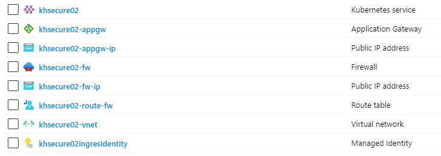

# Moved

This project has moved to https://github.com/Azure/Aks-Construction

Please go to the new repo to get the latest version!


# AKS Deploy helper

A comprehensive template that deploys a feature-complete, opinionated, AKS operating environment into your Azure subscription.

The script results in a tailored, operational AKS environment configured to meet your organization & application requirements, in addition, ensuring the latest recommended AKS configurations and features are followed.  

This accelerated provisioning script can save your project team many hours from sifting through the many advanced configuration options and addons, and manually hand-crafting environments. 

In addition, the script has been designed to be incorporated it into your CI/CD tools to fully automate  environment creation

### Build

```
bicep build ./main.bicep  --outfile build/main.json
```

### Click here to select your preffered AKS options, and generate the command line to deploy to Azure:

[](https://khowling.github.io/aks-deploy-wizard/)


### Example Resource Group after script deployment



***
