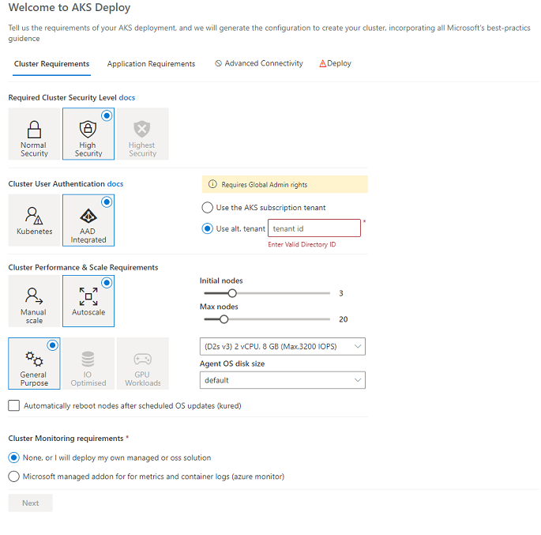

# AKS Deploy

A comprehensive, simplified AKS-based provisioning script that deploys a feature-complete, opinionated, best-practice AKS operating environment.

The script results in a tailored, operational AKS environment configured to meet your organization & application requirements, in addition, ensuring the latest recommended AKS configurations and features are followed.  

This accelerated provisioning script can save your project team many hours from sifting through the many advanced configuration options and addons, and manually hand-crafting environments. 

In addition, the script has been designed to be incorporated it into your CI/CD tools to fully automate  environment creation


#### Resource Group after script deployment


***

## Running the Script

There are 2 ways to run the script


It's **highly** recommended to run the script using this **[app](https://khcommon.z6.web.core.windows.net?v=v1.8)**, this will guide you through a series of questions where you can specify your cluster, application and networking needs. This results in the command line you can then paste into your linux terminal (or cloud shell) to launch the script.

#### app screen



***


Alternatively, you can manually run the script, constructing your own command line options, this is a great option once you have been through the app once, and you want to add to your automated release process


    ```
    Usage: ./deploy.sh ARGS [<rg>/]<cluster_name>
    args:
    <-l location> : Azure Region (required)
    [-c node count] : Mumber of virtual machine agent nodes in cluster (default 3)
    [-n kubenet | azure] : AKS network plugin (default: azure)
    [-v VM SKU ] : virtual machine size (default: Standard_D2s_v3)
    [-o OS-disksize ] : virtial machine OS disk size (defaults to VM default)
    [-t [tenantId]]: Use AAD Integration. If [tenantId] provided, an that alternative tenant id (YOU WILL NEED GLOBAL ADMIN role)
    [-a: features] : Can provide one or multiple features:
        clustrautoscaler=<max> - Enable cluster AutoScaler with max nodes
        vnet                   - create custom vnet
        onprem                 - create vnet Gateway subnet
        [nginx|appgw]          - create ingress
        dns=<rg/zone>          - auto create dns records
        cert=<cert_email>      - auto create TLS Certs with lets encrypt
        afw=<ServiceTag>       - Create Azure Firewall, include service tag for the region (ie AzureCloud.WestEurope)
        podsec                 - Pod Security Policy
        kured                  - install kured
        aci                    - install Azure Container Insights
        acr                    - install Azure Container Registry
        calico                 - install calico
        private-api            - Private Cluster (require jumpbox to access)
        policy                 - Apply gatekeeper (future)
    [-d] : Install Demo App
    ```

##  Conditional, tailored approach

The script configures all the recommended AKS options & addons, including all the additional resources to provide a fully-functional  environment ready to deploy production-ready applications.

One size does not fill all! To allow this script to be relevant for requirements between "I want a simple, secure, managed PaaS to deploy a webapp", to, "I need a hardened, locked down, secure environment to run my financial applications". The script conditionally provisions features/resources based on your operations requirements, and in many cases, offering preferences for Azure-native or OSS components covering:
* Cluster network security and user access
* Cluster and Application Monitoring
* H/W requirements (IO optimised, CPU optimised etc)
* Containers hosting options
* Application access requirements
* Application network connectivity requirements


## Requirements for running the script

Install the latest version of the az-cli, detailed here: https://docs.microsoft.com/en-us/cli/azure/?view=azure-cli-latest

Install the latest version of the helm client, detailed here: https://helm.sh/docs/using_helm/#installing-the-helm-client

NOTE: If the app indicates you will be using provisional features, ensure you follow these additional instructions:

https://docs.microsoft.com/en-us/azure/aks/availability-zones#register-feature-flags-for-your-subscription


At the time of writing, the default kubernetes version in the ARM template is `1.14.8`. As newer versions are supported, please ensure you update the minor version numbers as appropriate. NOTE: To see versions available in your region, run the following command:

```az aks get-versions --location <region> --output table```

NOTE: This script _can_ enable AAD integration for AKS, you will need to ensure you have a _Global Admin Login_ to your AAD tenant to grant the permissions needed by the AKS applications.  If you do not have administrator access to your subscriptions tenant, you can specify an alternative tenant (not related to your subscription tenant) using the `tenantId` argument to the `-t` flag.

Once the script has setup the requried AAD Applications and Service Principles, it will deploy the ARM Template ```azuredeploy.json```


## ARM Template information

The Template will create the following resources in your Azure subscription:

(optional - If DNS or ApplicationGateway selected)
* `<cluster_name>-ingresIdentity` - creates a `user-assigned Managed Identity` resource.  This Identity is used to update your Azure DNS Zone and Application Gateway configurations.  There are a number of additional nested `deploments` in the template to assign the required Roles to these resources.

(optional - If Application Gateway ingress selected)
* `<cluster_name>-appgw` - This will be your `Application Gateway WAF` Ingress Service_ for your applications


(optional - If Security Container Registry selected)
* `<cluster_name>acr` - This is the `Azure Container Registry` to securly host your containers.  The `AKS Service Principle` will be assigned the `AcrPullRole` role on this resource to allow AKS to pull images (accomplished by the deplyoment `ClusterRoleAssignmentForKubenetesSPN`) 

(optional - If `Custom Networking` is selected)
* `<cluster_name>-vnet` - This is a `VNET` to host the agent nodes.  The `AKS Service Principle` will be assigned the `Network Contributor` role on the agent subnet to allow AKS to create networking services (accomplished by the deplyoment `ClusterRoleAssignmentForKubenetesSPN`) 

(optional - If High Security Cluster is selected)
* `<cluster_name>-fw` - This is a `Azure Firewall` to protect your cluster egress traffic.  A UDR (Routing Rule) is defined on the aks node subnet to ensure all cluster egress traffic is routed through the firewall. The firewall is configured with the folowing:
    * Application rules: Configure fully qualified domain names (FQDNs) that can be accessed from a subnet, this list is sourced from : https://docs.microsoft.com/en-us/azure/aks/limit-egress-traffic#required-ports-and-addresses-for-aks-clusters
    * Network rules: Configure rules that contain source addresses, protocols, destination ports, and destination addresses. This is blocked
    * NAT rules: Configure DNAT rules to allow incoming connections.  This is blocked

(optional)
* `<cluster_name>-workspace` - This is the `Log Analytics Workspace` to store the cluster metrics and logging data 

(required)
* `<cluster_name>` - Your AKS cluster resource.


## Post Script

The post creation script runs after successful deployment of the ARM template, then uses the native kubernetes tools to setup the following:

* Creates a new namespace called `production`, creates a new namespace Role `user-full-access`, and assigns the current user to that role in the `production` namespace.

Sets up POD Identity for the `Application Gateway Ingress Controller` & `DNS Zone Controller`
https://github.com/Azure/application-gateway-kubernetes-ingress/blob/master/docs/setup/install-existing.md#set-up-aad-pod-identity

* Conditionally Install the Nginx or AppGW Ingress Controller Helm Chart & update parameters.

https://github.com/Azure/application-gateway-kubernetes-ingress/blob/master/docs/setup/install-existing.md#install-ingress-controller-as-a-helm-chart

* Conditionally Install the Azure DNS Zone Helm Chart & update parameters.

https://github.com/khowling/go-private-dns

* Conditionally Install the cert-manager Helm Chart & update parameters.

https://github.com/jetstack/cert-manager

* Conditionally installs demo app helm chart

https://github.com/khowling/aks-ecomm-demo


